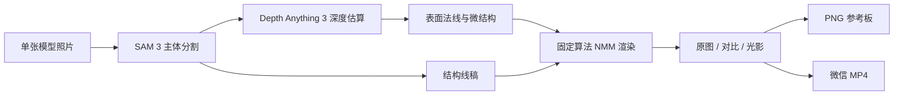

# NMM-detect

> 把一张微缩模型照片，变成可直接参考的 NMM（Non-Metallic Metal，非金属金属）光影指引。

[](https://github.com/digitalghost/NMM-detect/stargazers)
[](https://github.com/digitalghost/NMM-detect/commits/main)


[](LICENSE)

**NMM-detect** 是一个面向微缩模型、兵人和手办涂装者的本地 NMM 预演工具。导入单张照片后，它会自动识别主体、估算深度与表面法线，再使用可解释的固定渲染算法生成分层金属高光。你可以拖动光源、放大局部、切换材质，并导出带有光源位置和入射方向的 PNG 或微信友好的 MP4 参考图。

它不是“一键替你画完”的生成式绘画模型，而是一张可调整、可对照、可落笔的涂装地图。

**English:** NMM-detect is a local-first lighting study tool for miniature painters. It combines local subject segmentation and monocular geometry estimation with a deterministic NMM renderer, producing adjustable, annotated painting references from a single photo. See [English overview](#english-overview) below.

## 为什么做这个项目

NMM 并不只是还原真实金属反射。它需要画师主动安排明暗节奏，让装甲、武器、铆钉和甲片接缝即使在固定观看角度下也能保持清晰、锐利并且“像金属”。

传统做法通常依赖经验、反复试色或复杂的 3D 建模。NMM-detect 尝试提供一条更直接的路径：

1. 拍摄真实模型；
2. 从照片恢复足够用于涂装判断的形体信息；
3. 用稳定、可重复的算法安排主高光、补光和反射层次；
4. 输出一张能放在手机旁边照着画的参考图。

## 当前能力

- **自动主体分割**：使用本地 SAM 3 找出照片中的微缩模型。
- **漏识别区域补选**：在桶、武器、披风等遗漏部位框选矩形，重新识别并合并进主体。
- **单目深度与法线估算**：使用 Depth Anything 3 在主体区域进行最高 `1008 px` 推理。
- **局部高精度推理**：放大当前视口后重新裁切、放大和估算，提升小零件的有效采样密度。
- **线稿提取**：从主体轮廓、深度和局部曲率生成白底结构线稿，减少原始颜色与质感干扰。
- **固定算法 NMM 渲染**：AI 只负责识别和几何估算；最终光影由确定性的法线、材质与光照算法生成。
- **自动表面分块**：结合法线连续性、深度断层和结构线，将主体划分为平面、柱面、曲面、棱边与细节区域。
- **艺术塑形预设**：原始、平衡、竞赛三档可切换；新模式加入天空—地面反射带、暗肩和视觉焦点对比。
- **艺术化多光源**：主光、自动补光、细节光和环境反光协同工作，不强求完全物理真实，优先服务涂装可读性。
- **一至三次反射层次**：主反射色阶、材质冷调二次反射、材质暖调三次反射可分别呈现。
- **材质与色调预设**：白银、不锈钢、铝、黄金、红铜、青铜、黑钢，搭配原色、红、黄、绿、蓝、紫、黑色调。
- **金属质感控制**：调整光影强度、金属光滑度、法线平滑度、色阶数量和微结构光照。
- **快速对照**：原图、拖动分隔线对比、完整光影三种模式无需重复推理。
- **局部检查镜**：桌面端按住 `Alt/Option` 查看局部前后效果；触摸设备可长按查看。
- **离线导出**：生成高清参考板 PNG、当前画面 PNG，以及 H.264 微信对比视频。
- **光源说明**：所有导出成品都会标出 `L1` 主光源位置、方位和光线入射方向。

## 工作原理



这条工作流有意把“视觉理解”和“最终上色”分开：

- **视觉模型**负责主体、深度和形体线索；
- **渲染器**负责可重复的光照、材质、色阶与反射规则；
- **用户**负责决定艺术方向并把参考转化为真实涂装。

因此，同一组参数始终会得到一致的结果，也不需要为每次 NMM 生成调用云端大模型。

## 运行要求

当前版本主要在以下环境验证：

- macOS + Apple Silicon；
- Python `3.12`；
- 建议 `24 GB` 统一内存；
- 约 `8 GB` 模型权重存储空间，另需为 Python 环境和推理输出预留空间；
- 推荐安装 [uv](https://docs.astral.sh/uv/)；
- MP4 导出推荐安装 FFmpeg，程序也会尝试使用 `imageio-ffmpeg` 提供的编码器。

CUDA/Linux 理论上可以通过 PyTorch 运行，但目前不是已完整验证的平台。纯 CPU 可以作为兼容回退，速度会明显降低。

## 当前版本与平台状态

当前版本为 `0.3.5`：

| 形态 | 当前状态 | 模型交付方式 | 主要要求 |
| --- | --- | --- | --- |
| 源码 / 本地 Web | 可用，主要在 Apple Silicon 验证 | 首次运行前下载到 `.models/` | Python 3.12，建议 24 GB 统一内存 |
| macOS 应用 | 可构建自包含 `.app` 和 DMG | 构建时把桌面模型放入应用包 | Apple Silicon、macOS 14+；当前为 ad-hoc 签名 |
| Android 应用 | 完整离线版，可构建可安装 APK | 构建时把四个 ONNX 文件放入 APK | ARM64、Android 9+；建议 12 GB RAM、至少 8 GB 可用空间 |

照片导入现在统一转换为最长边 `2048 px` 的 sRGB PNG，单文件限制为 64 MB、6000 万像素。桌面结果缓存限制为最近 20 次、最多 512 MB、最长 7 天；Android 缓存限制为最近 12 次或 512 MB。本地服务只公开界面文件与分析产物，并拒绝非本机 Host 和跨站 API 写请求。

### 下载发行包还是下载源码

- 如果发布页提供已经构建好的 **DMG 或 APK**，模型已经包含在安装包中。最终用户安装后无需再运行模型下载脚本。
- 如果下载的是 **Git 仓库或 Source code 压缩包**，仓库不会包含模型权重。请按下面的源码流程下载模型并生成对应平台的安装包。
- 模型由原始发布方单独授权。生成或分发包含模型的 DMG/APK 前，请确认使用场景符合 SAM 3 与 Depth Anything 3 的许可条款。

## 源码 / 本地 Web 快速开始

### 1. 克隆仓库

```bash
git clone https://github.com/digitalghost/NMM-detect.git
cd NMM-detect
```

### 2. 创建环境并安装依赖

```bash
uv sync --python 3.12
```

其余依赖由 `uv.lock` 固定。Depth Anything 3 上游会额外声明本项目不需要的训练依赖，因此继续以固定提交、`--no-deps` 方式安装：

```bash
UV_CACHE_DIR=/tmp/nmm-detect-uv-cache \
uv pip install --python .venv/bin/python --no-deps \
'git+https://github.com/ByteDance-Seed/depth-anything-3.git@3d835ec1a5802d64a8b8b15f817a1ab54809bfe4'
```

在 macOS 上执行项目自带的兼容补丁：

```bash
.venv/bin/python scripts/patch_da3_macos.py
```

如果需要系统 FFmpeg：

```bash
brew install ffmpeg
```

### 3. 下载本地模型

```bash
.venv/bin/python scripts/download_models.py
```

默认通过 ModelScope 下载以下模型，下载支持断点续传：

- `facebook/sam3`
- `depth-anything/DA3-LARGE-1.1`

也可以只下载其中一个：

```bash
.venv/bin/python scripts/download_models.py sam3
.venv/bin/python scripts/download_models.py da3
```

模型会放在 `.models/`，该目录不会进入 Git。

### 4. 启动

macOS / Apple Silicon：

```bash
PYTORCH_ENABLE_MPS_FALLBACK=1 \
MPLCONFIGDIR=/tmp/nmm-detect-matplotlib \
.venv/bin/python scripts/run_local.py
```

然后打开：

```text
http://localhost:4173
```

## 部署 macOS 应用

macOS 构建会把 Python 3.12 运行时、依赖、前端和 `.models/` 中需要的权重放进应用包。收到已经构建好的 DMG 的用户无需单独下载模型。

### 从源码生成 DMG

先完成上面的环境安装、DA3 固定提交安装、macOS 兼容补丁和模型下载，然后安装 Xcode Command Line Tools 并构建：

```bash
xcode-select --install
.venv/bin/python macos/build.py --dmg
```

构建脚本会在开始时检查以下文件，缺少任何一个都会直接停止并给出路径：

- `.models/sam3/config.json`
- `.models/sam3/model.safetensors`
- `.models/da3-large-1.1/config.json`
- `.models/da3-large-1.1/model.safetensors`

产物位于：

```text
dist/macos/NMM Studio.app
dist/macos/NMM-Studio-AppleSilicon.dmg
dist/macos/SHA256SUMS.txt
```

当前应用使用 ad-hoc 签名，适合本机和开发测试。首次打开可在 Finder 中右键应用并选择“打开”。面向其他用户公开分发时，维护者仍需使用 Apple Developer ID 签名并完成 Apple 公证。

更详细的运行行为与回归检查见 [`macos/README.md`](macos/README.md)。

## 部署 Android APK

Android 模型不会从网络下载到手机。构建电脑先把桌面模型导出为固定尺寸 ONNX 文件，Gradle 再把四个文件、大小和 SHA-256 清单一起写入 APK。手机首次分析时会把模型流式释放到应用私有目录并校验，之后可以完全离线运行。

### 1. 准备桌面模型

先完成上面的 Python 环境、DA3 固定提交安装与模型下载。如果构建电脑是 macOS，也需要先运行：

```bash
.venv/bin/python scripts/patch_da3_macos.py
```

### 2. 导出 Android ONNX 模型

在仓库根目录运行：

```bash
.venv/bin/python scripts/export_sam3_android.py
.venv/bin/python scripts/export_da3_android.py
```

完成后应存在：

```text
android-probe/models/sam3-miniature-1008.onnx
android-probe/models/sam3-miniature-1008.onnx.data
android-probe/models/da3-large-1008x756.onnx
android-probe/models/da3-large-1008x756.onnx.data
```

这些文件合计约 3.4 GB，被 Git 忽略，但会作为 Gradle 构建输入。目录中用于实验的 Vulkan `.pte` 文件不会进入 APK。

### 3. 构建 APK

安装 JDK 17 和 Android SDK 34，设置 `JAVA_HOME` 与 `ANDROID_HOME`，然后运行：

```bash
(cd android-probe && ./gradlew assembleDebug)
```

Gradle 会检查四个模型、生成 SHA-256 清单，并固定使用 Maven Central 上的 ONNX Runtime Android `1.30.0`。缺少模型时构建会直接失败并显示缺失路径。

可安装 APK 位于：

```text
android-probe/app/build/outputs/apk/debug/app-debug.apk
```

### 4. 安装到手机

连接已启用 USB 调试的 ARM64 Android 设备：

```bash
adb install -r android-probe/app/build/outputs/apk/debug/app-debug.apk
```

也可以把 APK 复制到手机后通过系统安装器打开。APK 约 3.5 GB，安装 APK 与首次释放私有模型期间建议至少预留 8 GB 可用空间。首次分析会显示模型释放进度，请保持应用在前台。当前 `debug` APK 使用 Android 调试签名；公开分发需要配置正式 release keystore。

更详细的设备基线、内存占用和回归方法见 [`android-probe/README.md`](android-probe/README.md)。

## 使用方法

1. 点击左侧的 **导入模型照片**。上传完成后会自动开始主体分割和深度估算。
2. 如果背包、武器或底座漏选，点击 **补充识别区域**，框住遗漏部位后重新分析。
3. 直接拖动画面中的太阳，确定主光源方向。
4. 使用 **光影强度**、**金属光滑度**和**光影平滑**完成主要调整。
5. 从材质和光谱色调中选择目标效果；特殊需求再展开高级设置。
6. 使用 **原图 / 对比 / 光影**检查结果，最后从右侧面板导出。

### 缩放与局部推理

- 右侧缩放尺支持 `1×` 到 `3×` 视口缩放；
- 停止缩放约 `0.8` 秒后，程序会对当前视口重新进行 `1008 px` 深度推理；
- 这不会凭空创造照片中不存在的细节，但能把原图已有的铆钉、刻线和甲片接缝分配到更多有效采样点；
- 缩回 `1×` 可回到完整模型。

### 快速比较

- **对比模式**：拖动中间分隔线；左侧为原图，右侧为 NMM 光影。
- **临时查看**：按住“原图”按钮，松开后回到原模式。
- **检查镜**：桌面端按住 `Alt/Option` 并移动鼠标。
- **快捷切换**：按 `\` 在原图和上一次光影模式之间切换。

## 导出格式

### 高清对照 PNG

一张适合保存、打印或放在平板旁参考的完整画板，包括：

- 原始照片；
- 照片上的 NMM 上色；
- 纯光影指引；
- 主反射色阶与二、三次反射图例；
- 当前材质、光滑度和光影强度；
- 主光源位置与光线入射方向。

### 微信对比视频 MP4

约 4 秒的无声擦拭动画：

1. 原图停留；
2. 分隔线扫过并显示 NMM；
3. 完整光影停留；
4. 分隔线反向扫回原图。

视频使用 H.264 Main、`yuv420p`、24 fps、1080 像素边界和 fast-start，优先兼容微信、iPhone 相册和常见安卓设备。

### 当前画面 PNG

按当前的原图、对比或光影状态导出。识别矩形不会被画进成品，光源说明会保留。

## 怎样拍出更容易识别的照片

- 推荐使用 **40–60% 明度的中性哑光灰补土**；
- 避免纯黑、纯白、金属色和强反光底漆；
- 使用干净、对比明确但不过曝的背景；
- 从侧上方提供柔和的大面积照明，让细小凹凸保留基础明暗；
- 保证对焦准确，尽量让主体占据画面主要区域；
- 不要使用过强的人像虚化、锐化滤镜或低质量社交软件压缩图。

灰色哑光表面对分割、单目深度和微结构提取更友好，也更接近真实涂装前的工作状态。

## 隐私与离线能力

完成依赖和模型下载后，日常分析不需要联网：

- 照片不会上传到第三方推理服务；
- 模型、推理和导出都在本机进行；
- 分析产物保存在本地 `output/`，自动限制为最近 20 次、最多 512 MB，并清理超过 7 天的缓存；
- `output/`、`.models/` 和 `.venv/` 默认被 Git 忽略。

## 项目结构

```text
NMM-detect/
├── index.html                 # 单页界面
├── styles.css                # Spectral Monolith UI
├── app.js                    # 交互、NMM 渲染、比较与导出
├── backend/
│   ├── image_import.py       # HEIF/JPEG/PNG/WebP 安全规范化
│   ├── server.py             # FastAPI、本地分析与 MP4 导出
│   ├── pipeline.py           # SAM 3、DA3 与局部推理工作流
│   └── nmm_shader.py         # 线稿、法线与光影辅助算法
├── android-probe/             # ARM64 Android 离线应用与 ONNX 构建
├── macos/                     # AppKit 应用、打包与 DMG 构建
├── scripts/
│   ├── run_local.py          # 本地服务入口
│   ├── download_models.py    # ModelScope 模型下载
│   ├── export_sam3_android.py
│   ├── export_da3_android.py
│   ├── patch_da3_macos.py    # DA3 macOS 兼容补丁
│   └── smoke_models.py       # 模型冒烟测试
├── tests/                     # 导入、几何与跨端渲染验证
├── docs/
│   └── depth-precision-roadmap.md
├── pyproject.toml
└── uv.lock                    # Python 3.12 可复现依赖锁
```

## 本地 API

| Endpoint | 用途 |
| --- | --- |
| `GET /api/health` | 检查设备、模型与深度配置 |
| `POST /api/analyze` | 主体分割、深度、法线和线稿分析 |
| `POST /api/refine` | 对选定视口进行局部高精度推理 |
| `POST /api/export-mp4` | 生成 H.264 擦拭对比视频 |
| `POST /api/export-gif` | 旧版 GIF 导出兼容接口 |

## 精度边界

当前默认深度推理分辨率固定为最长边 `1008 px`。这是精度、显存和响应时间之间的实用平衡，并不等同于恢复真实微米级几何。

影响结果的主要因素包括：

- 原始照片是否真正记录了细节；
- 主体在照片中占据的像素数量；
- 表面纹理、涂装和真实凹凸之间是否存在歧义；
- 单张照片无法观察到的遮挡区域；
- 单目深度模型对微型硬表面结构的先验能力。

已讨论的更高分辨率、16-bit 深度、分块融合和局部多尺度方案记录在 [深度与点云精度提升路线图](docs/depth-precision-roadmap.md)。

## 已知限制

- 桌面版目前重点验证 Apple Silicon；Windows、Linux 和 CUDA 仍需要更多测试与安装说明；
- Android 目前只验证了 ARM64 高内存设备，峰值原生内存约 6–7 GB；低内存设备可能无法完成推理；
- Android APK 约 3.5 GB，不适合常规应用商店的单包体积限制；当前更适合直接安装或内部发布；
- macOS 包当前仅为 ad-hoc 签名；跨设备公开分发需要 Developer ID 签名和 Apple 公证；
- 首次下载、模型导出和安装体积较大；
- 透明件、镜面表面、极暗或过曝照片会降低分割与深度质量；
- 单张照片无法可靠恢复模型背面或完全遮挡的结构；
- 输出是涂装设计参考，不是物理测量结果，也不是完整 3D 扫描；
- 多光源模式带有艺术化设计，目标是增强可读性，不保证严格满足现实光学。

## 路线图

- [ ] 更完整的 Windows / CUDA 与 Linux 安装流程
- [ ] 可选择的高分辨率分块推理与显存预算
- [ ] 16-bit 深度缓存，减少重复归一化损失
- [ ] 多尺度法线融合，进一步增强铆钉和刻线
- [ ] 参数预设的导入、导出与分享
- [ ] Android 模型量化、分包与安装体积缩减
- [ ] 更适合打印的涂装分区与编号参考页

## 开发与验证

基础检查：

```bash
node --check app.js
.venv/bin/python -m compileall -q backend scripts
```

模型冒烟测试：

```bash
PYTORCH_ENABLE_MPS_FALLBACK=1 \
MPLCONFIGDIR=/tmp/nmm-detect-matplotlib \
.venv/bin/python scripts/smoke_models.py
```

深度分辨率测试和区域提示测试位于 `scripts/`。这些脚本可能占用较多显存，请避免同时启动多个推理进程。

## 参与项目

欢迎提交 Issue、测试照片的匿名化结果、安装反馈和 Pull Request，尤其欢迎以下方向：

- 不同微缩模型类型的分割失败案例；
- Windows、Linux、CUDA 与较低内存设备测试；
- NMM 色阶、材质和艺术布光方案；
- 局部法线、曲率和边缘提取算法；
- 对微缩涂装初学者更友好的交互与教程。

提交问题时，请尽量附上操作系统、芯片/GPU、内存、Python 版本、照片分辨率和错误日志。公开照片前，请先移除人物、地址或其他私人信息。

如果这个项目对你的涂装有帮助，欢迎点一个 Star、分享你的测试结果，或者告诉我们哪一块金属仍然“不够像金属”。

## 致谢

本项目的本地视觉工作流建立在以下开源生态之上：

- SAM 3：主体识别与分割；
- [Depth Anything 3](https://github.com/ByteDance-Seed/depth-anything-3)：单目几何估算；
- [PyTorch](https://pytorch.org/)：本地模型推理；
- [FastAPI](https://fastapi.tiangolo.com/)：本地服务；
- [FFmpeg](https://ffmpeg.org/)：兼容性视频编码。

模型权重不包含在本仓库中，并分别受其原始发布方许可约束。使用或分发前请查看对应模型页面的许可证与使用条件。

## 许可证

项目代码使用 [Apache License 2.0](LICENSE)。第三方依赖与模型权重仍遵循各自的许可证；Apache 2.0 不会替代或扩大这些第三方许可。

## English overview

NMM-detect turns a single miniature photo into an adjustable Non-Metallic Metal painting guide. The application runs subject segmentation and monocular geometry estimation locally, then uses a deterministic renderer for stepped highlights, secondary reflections, tertiary reflections, artistic fill light and micro-detail lighting.

Key features:

- local-first inference after model download;
- SAM 3 subject segmentation with manual region supplementation;
- Depth Anything 3 depth and surface-normal estimation;
- viewport zoom with local `1008 px` re-inference;
- silver, steel, aluminium, gold, copper and bronze material presets;
- draggable lighting, stepped values and adjustable metal smoothness;
- original/NMM split comparison and inspection lens;
- annotated PNG boards and WeChat-friendly H.264 MP4 exports;
- explicit light-source position and incident-light direction on exports;
- self-contained Apple Silicon macOS app packaging;
- an ARM64 Android build that bundles verified ONNX model files inside the APK.

Prebuilt DMG/APK artifacts include their required model files. Source checkouts intentionally exclude model weights; builders must download the original SAM 3 and Depth Anything 3 models and follow the platform deployment sections above. The project is intended as a practical painting reference—not a physically exact scan or an automatic replacement for the painter.
